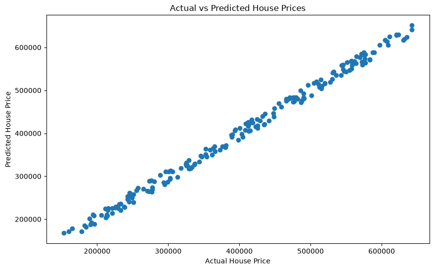

# House Price Prediction Using Machine Learning

## Project Overview

This project uses Linear Regression to predict house prices based on:

- Number of Bedrooms
- Number of Bathrooms
- Square Footage
- House Age

The goal is to demonstrate a complete machine learning workflow including:

- Data generation
- Data cleaning
- Exploratory data analysis
- Model training
- Model evaluation
- Visualization

---

## Technologies Used

- Python
- Pandas
- NumPy
- Matplotlib
- Scikit-Learn
- Jupyter Notebook

---

## Dataset

The dataset contains 1,000 housing records with the following features:

| Feature | Description |
|----------|------------|
| Price | House sale price |
| Bedrooms | Number of bedrooms |
| Bathrooms | Number of bathrooms |
| SquareFeet | House size in square feet |
| Age | House age in years |

---

## Machine Learning Model

Model Used:

- Linear Regression

Train/Test Split:

- 80% Training
- 20% Testing

---

## Model Performance

Results:

- MAE: 8,286.77
- MSE: 87,447,003.97
- R² Score: 0.9951

The model explains approximately 99.5% of the variation in house prices.

---

## Visualization

### Actual vs Predicted Prices

---

## Sample Prediction

Example House:

- Bedrooms: 4
- Bathrooms: 3
- Square Feet: 2200
- Age: 5

Predicted Price:

$274,615.38

---

## Author

Hosheyah Yisrael

Computer Science Student

University of Advancing Technology
